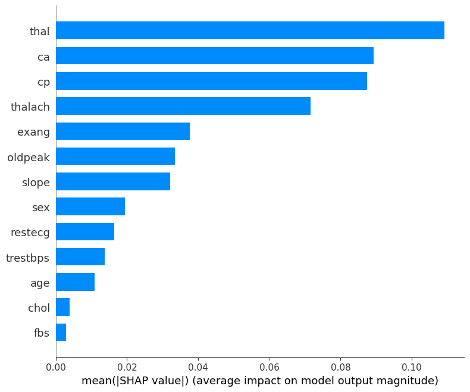
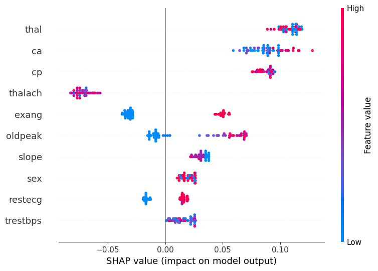

# Heart Disease Risk Prediction with Explainable AI

This project applies machine learning models to predict heart disease risk using clinical data and explains model decisions using SHAP.

## Technologies
Python, Pandas, NumPy, Scikit-learn, SHAP, Matplotlib, Seaborn

## Models
- Logistic Regression
- Random Forest

## Model Evaluation

### Confusion Matrix

The confusion matrix shows strong predictive performance with very few false negatives, which is critical in healthcare risk prediction.

## Explainable AI Results

### Global Feature Importance

This plot highlights the most influential clinical features affecting heart disease predictions.

### Feature Impact Distribution

The beeswarm plot shows how high and low feature values increase or decrease predicted disease risk.

## How to Run
Open the Jupyter notebook and run all cells sequentially to reproduce results.
